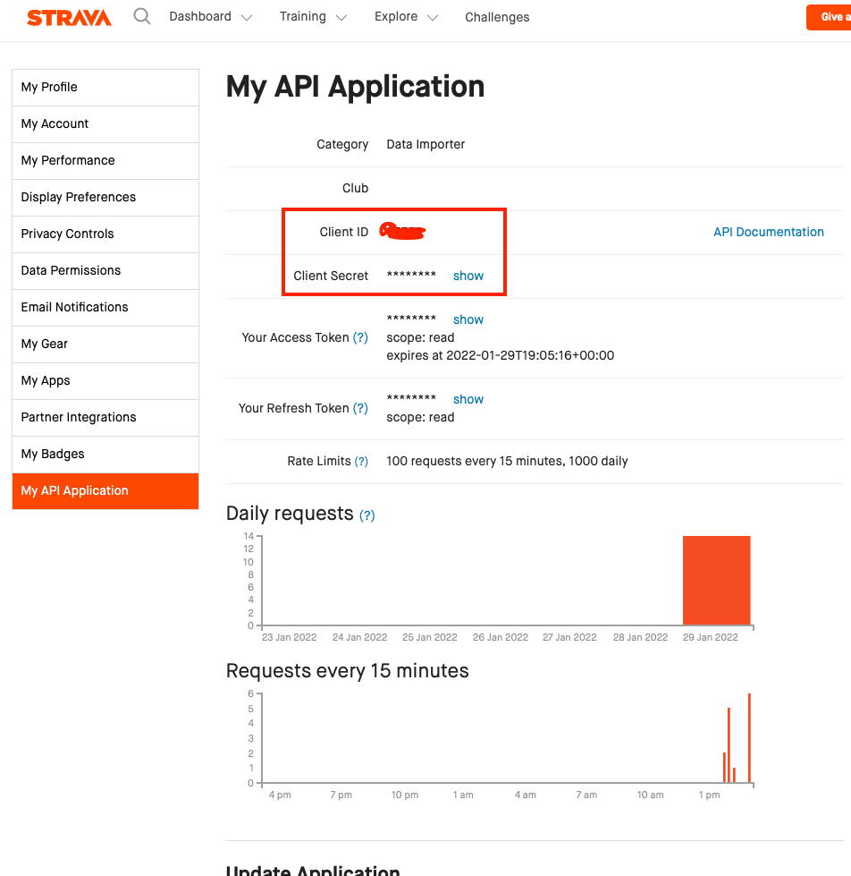
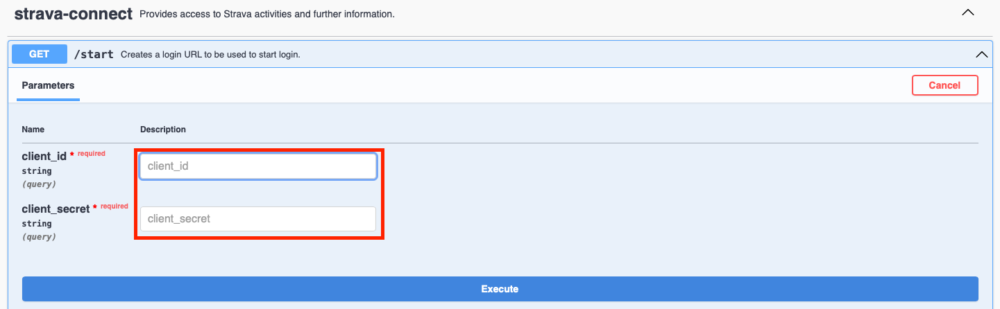
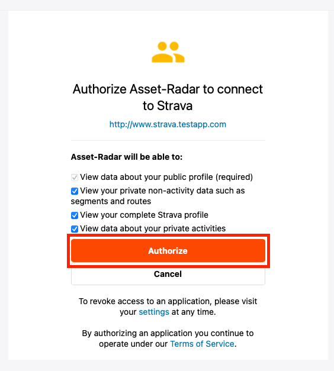
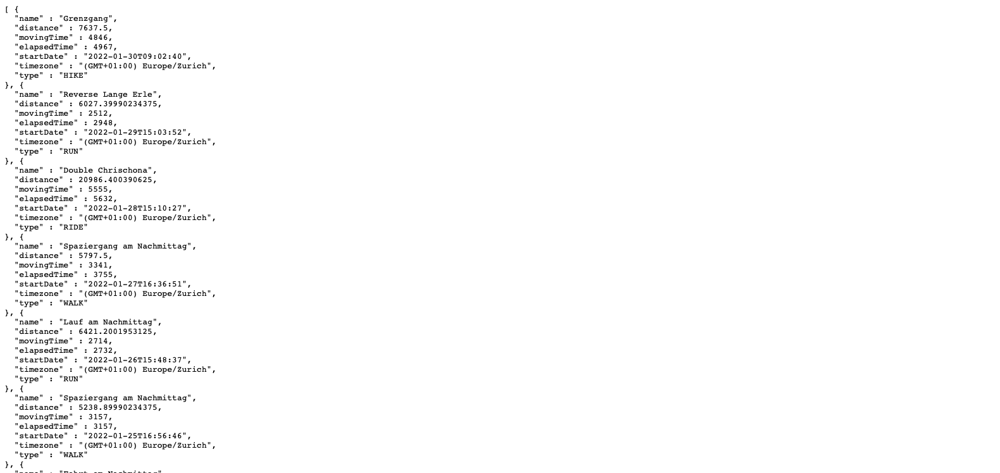
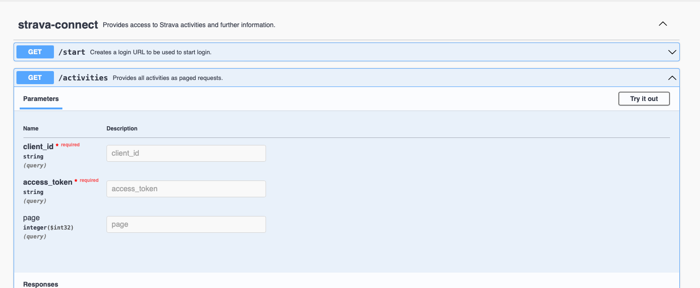
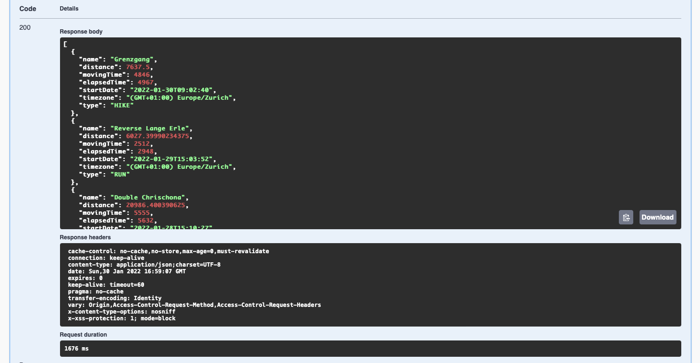
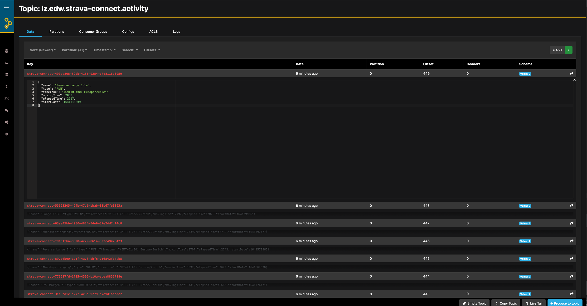

# User Guide

## Prerequisites
### Log-in on Strava
Create a new account on https://www.strava.com or log-in onto an existing.

### Add API Application
Make sure you have created a new application that is allowed to consume the Strava API.

### Swagger UI
It is intended to use the swagger UI of the strava connect service as we do not think it is necessary to provide an extra UI.
Thus, you need to start the spring boot service `strava-connect` using one of the following commands:
* `mvn spring-boot:run`
* `java -jar target/strava-connect-<version>.jar com.baloise.open.strava.edw.StravaConnectApp`

## Create Strava Authentication URL
For the first step you need client ID and secret which can be retrieved from Strava using https://www.strava.com/settings/api:



You now have to select the `start` operation on http://localhost:9099/stravaconnect/openapi-ui.html and add your client ID and secret.



The response will contain the following URL:
```
{
  "url": "https://www.strava.com/oauth/authorize?client_id=<client-id>&
        redirect_uri=http://localhost:9099/stravaconnect/auth?client_id=<client-id>&
        client_secret=<client-secret>&
        response_type=code&approval_prompt=auto&
        scope=read_all,profile:read_all,activity:read_all&
        state=<client-secret>"
}
```

## Authorize With Strava
Paste that URL from the step before into your browser and click "Authorize" on the screen:



As a result you will get the following response:
```
{
  "baseUrl" : "http://localhost:9099/stravaconnect",
  "clientId" : "<client-id>>",
  "accessToken" : "<access-token>",
  "page" : 1,
  "activitiesUrl" : "http://localhost:9099/stravaconnect/activities?client_id=<client-id>>&access_token=<access-token>&page=1"
}
```

## Use Activities URL
### Browser
Now you can copy and paste that URL to another browser tab/ window: you will see all activities in a paged mode of
the latest 20 activities:



### Swagger UI
You can add client-id and access token also to the `activities` operation on your swagger UI:



As a result you get the latest 20 activities in a paged mode:



## Check Events
Accessing AKHQ should indicate you, that these activities have been added to the topic `lz.edw.strava-connect.activity` using the
URL http://localhost:9000/ui/kafka-localhost/topic/lz.edw.strava-connect.activity/data?sort=Newest&partition=All:



# Congratulations
You completed the first step of importing data using the strava API.
